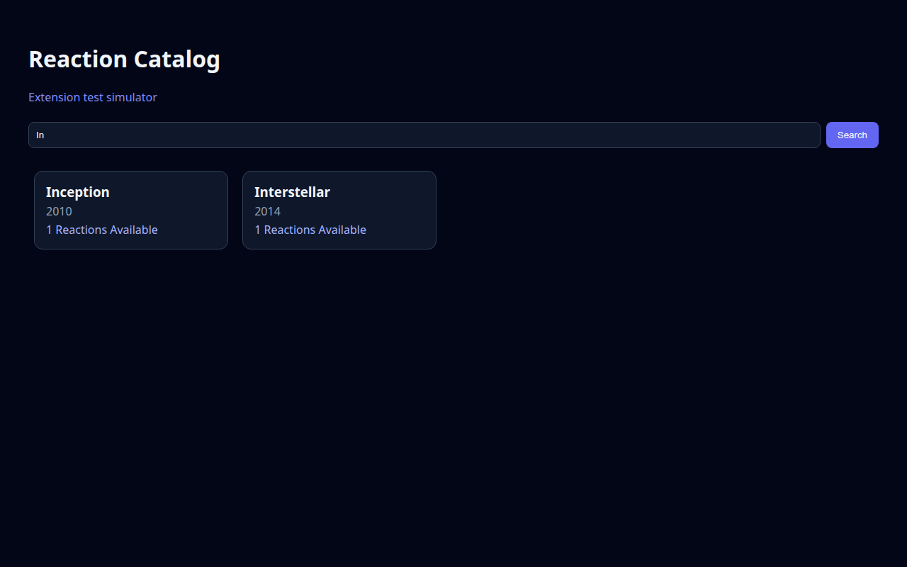
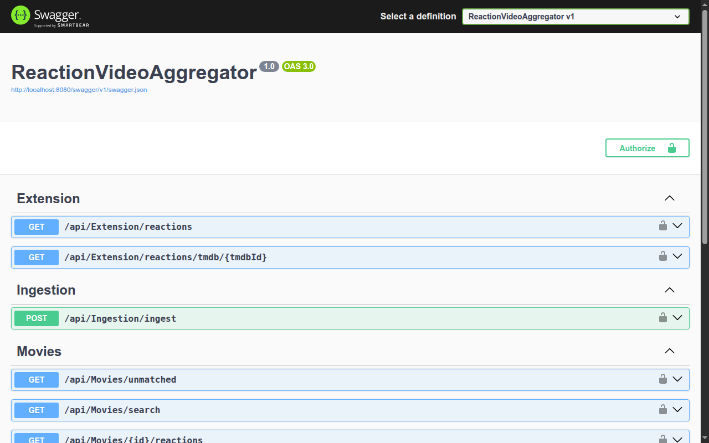
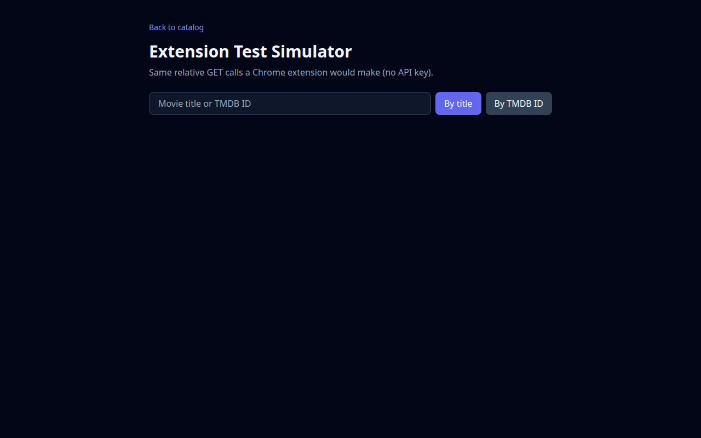

# Reaction Video Aggregator

ASP.NET Core 8 API that aggregates YouTube/Patreon reaction videos, matches them to TMDB movies, and serves a small catalog UI.

## Live demo

**https://reaction-video-aggregator.onrender.com**

> Free Render tier: the service sleeps after ~15 minutes idle (first request may take ~1 minute). Free Postgres expires after 30 days unless upgraded.

## Screenshots

### Catalog search


### Movie reactions


### Swagger API


### Extension test page


## Stack

- C# ASP.NET Core 8 Web API
- Entity Framework Core + PostgreSQL (`jsonb` for Patreon/social metadata)
- Background workers for TMDB matching and RSS monitoring
- Strategy pattern for platform ingestion (YouTube / Patreon)

## Local run (Docker)

1. Copy env files and set keys:

```bash
cp .env.example .env
cp appsettings.Development.json.example appsettings.Development.json
# edit .env / appsettings.Development.json with your TMDB + admin keys
```

2. Start Postgres + API:

```bash
docker compose up --build
```

3. Open:

- Catalog UI: http://localhost:8080/
- Swagger: http://localhost:8080/swagger
- Extension simulator: http://localhost:8080/extension-test.html

## Main API routes

| Method | Path | Notes |
|--------|------|--------|
| GET | `/api/Movies/search?q=` | Search movies |
| GET | `/api/Movies/{id}/reactions` | Reactions for a movie |
| GET | `/api/Movies/unmatched` | Videos waiting for TMDB match |
| POST | `/api/Ingestion/ingest?url=` | Admin (`x-api-key`) ingest |
| GET | `/api/Extension/reactions` | Chrome extension helpers |
| GET/POST | `/api/Reactors` | Reactor profiles / tracking |

## Deploy (Render)

1. Create a free **PostgreSQL** database on Render.
2. Create a **Web Service** from this repo (Docker).
3. Set environment variables:

- `ConnectionStrings__DefaultConnection` — Render internal Postgres URL (add `SSL Mode=Require` if needed)
- `TmdbOptions__ApiKey` — TMDB API key
- `AdminSettings__ApiKey` — admin key for POST endpoints
- `ASPNETCORE_ENVIRONMENT=Production`

EF migrations run automatically on startup.

## License

MIT
